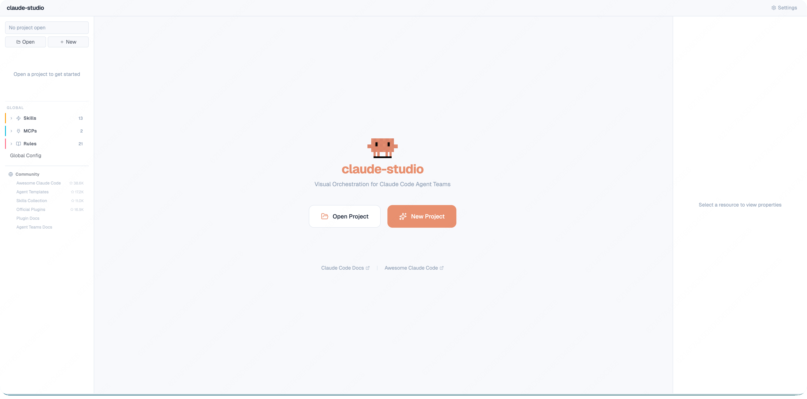
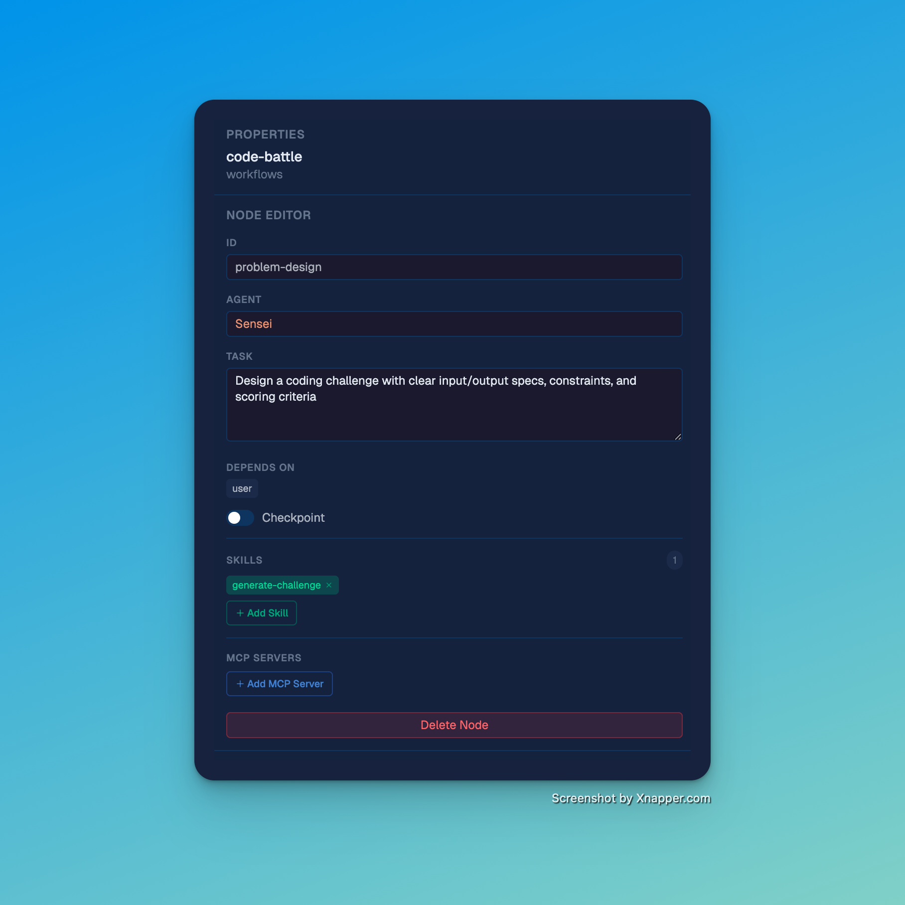

<div align="center">
  
  <h1>harness-studio</h1>
  <p><strong>面向 Agent 编程团队的跨平台 Harness 环境管理平台。</strong></p>
  <p><em>基于一份 Harness 工程映射 Claude Code、Codex、Cursor 等不同运行环境，并可视化管理多 Agent 工作流。</em></p>

  <p>
    <a href="https://www.npmjs.com/package/harness-studio"></a>
    <a href="https://www.npmjs.com/package/harness-studio"></a>
    <a href="https://github.com/androidZzT/harness-studio/stargazers"></a>
    <a href="LICENSE"></a>
    
  </p>

  <p>
    <a href="#功能特性">功能特性</a> &bull;
    <a href="#项目定位">项目定位</a> &bull;
    <a href="#截图">截图</a> &bull;
    <a href="#快速开始">快速开始</a> &bull;
    <a href="#使用流程">使用流程</a> &bull;
    <a href="README.md">English</a>
  </p>
</div>

---

## 功能特性

- 🧭 **Harness 工程模型** — 将一个仓库级 Harness 工程作为 Agent、Workflow、Skill、Prompt、运行记录和平台映射的统一事实源
- 🔁 **平台适配器** — 将同一份 Harness 意图映射到 Claude Code (`.claude/`)、Codex、Cursor 以及未来的 Agent 运行环境
- 🔀 **可视化工作流编辑器** — 拖拽式 DAG 编辑，管理多 Agent phase、依赖、checkpoint 和并行分支
- 📈 **Run 可视化** — 读取 `.harness/runs`，展示节点状态、prompt、日志、工具调用、skill 使用、validation、rollback 和产物
- 🤖 **Agent 管理** — 创建/编辑/删除 Agent，支持内置模板和平台相关元信息
- ⚡ **Skill 和工具管理** — 创建可复用 Skill，并绑定 MCP/工具能力到工作节点
- 🚀 **执行态视图** — 查看 running/succeeded/failed/blocked 等 phase 状态
- 🪄 **AI 生成** — 用自然语言描述，生成 Harness Workflow/Agent/Skill 草稿
- 🔌 **MCP 和设置** — 可视化管理 MCP 服务器、Hook、权限和运行时配置
- 📦 **环境导出** — 将 Harness 工程同步/导出为平台特定文件
- 🧠 **记忆检视** — 只读查看项目记忆，支持清理过期记忆
- 🎯 **CLAUDE.md 同步** — 当前 Claude Code 适配器可将工作流同步到 `CLAUDE.md`
- 🌓 **主题切换** — 深色、浅色、跟随系统
- ⚙️ **项目配置** — 按项目管理共享和本地 Agent 运行时配置

---

## 项目定位

harness-studio 不再定位为某一个 Agent CLI 的 GUI，而是一个**跨平台 Harness 环境管理平台**：

| 层级 | 作用 |
|---|---|
| Harness 工程 | 统一事实源：工作流 phase、Agent 角色、Skill、Prompt、run store、validation、rollback 和平台映射 |
| 平台适配器 | 将 Harness 工程翻译为 Claude Code `.claude/`、Codex 配置、Cursor rules/prompts，以及未来更多工具的运行环境 |
| 工作流可视化 | 同时展示设计态 DAG 和 `.harness/runs` 中的真实执行态 DAG |
| 多 Agent 运维 | 管理 phase 状态、prompt、日志、工具轨迹、skill 使用、产物、gate、checkpoint 和恢复路径 |

当前实现已经具备 Claude Code 兼容的 `.claude/` 适配和真实 `.harness/runs` 可视化。Codex 与 Cursor 是下一阶段的平台适配目标：核心模型需要保持平台中立，具体 adapter 再写出各平台需要的文件。

更完整的产品模型见 [docs/product/positioning.md](docs/product/positioning.md)。

---

## 与 harness-cli 的关系

harness-studio 是控制面，`harness-cli` 是执行和治理数据面。

| 职责 | 归属 |
|---|---|
| 解析 compound `SKILL.md` phases、gate、audit、checkpoint、TaskCard、dry-run preflight | `harness-cli` |
| 跨 Claude Code / Codex 工具执行 autonomous run | `harness-cli` |
| 写入 `.harness/runs` 产物、trajectory、validation、rollback、run-family 元数据 | `harness-cli` |
| 读取并可视化 run DAG、节点状态、prompt、日志、trace、skill、tool、artifact | `harness-studio` |
| 将一份 Harness 环境映射成平台特定文件 | `harness-studio` adapters |

Studio API 已新增项目级 `harness-cli` 桥接入口：

| Endpoint | 用途 |
|---|---|
| `GET /api/projects/:id/harness-cli` | 检查当前项目是否可调用 `harness` |
| `POST /api/projects/:id/harness-cli/dry-run` | 执行 `harness run --dry-run ... --json` |
| `POST /api/projects/:id/harness-cli/inspect` | 执行 `harness run inspect <threadId> --json` |
| `POST /api/projects/:id/harness-cli/view` | 执行 `harness run view <threadId> --json` |

如果 `harness` 不在 `PATH`，可以用 `HARNESS_CLI_BIN=/path/to/harness` 指定。

长时间真实执行后续应基于 `harness run` 做独立 job/stream；当前 Studio `/api/execute` 仍是 legacy runner，不应该继续作为真实执行事实源。

## Monorepo 结构

当前仓库已经同时包含 Studio 控制面和 Harness CLI 数据面。

| 路径 | 作用 |
|---|---|
| `src/` | Next.js Web 应用、API 路由和 Studio UI |
| `extensions/vscode/` | VS Code 插件宿主集成 |
| `packages/studio-core/` | Web 与 VS Code 共用的 Studio reader/parser |
| `packages/core/` | 导入后的 `@harness/core` 运行时模型与 CLI 共享逻辑 |
| `packages/cli/` | 导入后的 `harness` CLI 包 |
| `docs/` | 产品、架构、指南，以及整理后的 Harness CLI/Core 文档 |
| `scripts/harness-cli/` | 适配 monorepo 的 CLI 构建辅助脚本 |

常用命令：

```bash
npm run harness:build       # 构建 packages/core + packages/cli
npm run harness:typecheck   # 类型检查 CLI/core 包
npm run harness:test        # 运行导入的 harness-cli 测试套件
npm run verify:visual-workflow
npm run monorepo:build      # 构建 CLI、studio-core 和 Web 应用
```

Studio 可以直接调用仓库内的 CLI：

```bash
HARNESS_CLI_BIN=$PWD/packages/cli/dist/cli.js npm run dev -- -p 3100
```

---

## 截图

<table>
  <tr>
    <td align="center"><strong>深色模式</strong></td>
    <td align="center"><strong>浅色模式</strong></td>
  </tr>
  <tr>
    <td></td>
    <td></td>
  </tr>
  <tr>
    <td align="center"><strong>工作流 DAG</strong></td>
    <td align="center"><strong>项目工作区</strong></td>
  </tr>
  <tr>
    <td></td>
    <td></td>
  </tr>
  <tr>
    <td align="center"><strong>节点编辑器</strong></td>
    <td align="center"><strong>项目配置</strong></td>
  </tr>
  <tr>
    <td></td>
    <td></td>
  </tr>
</table>

---

## 快速开始

```bash
npx harness-studio
```

自定义端口：

```bash
npx harness-studio --port 3200
```

### 开发模式

```bash
git clone https://github.com/androidZzT/harness-studio.git
cd harness-studio
npm install
npm run dev -- -p 3100
```

### VS Code 插件（MVP）

仓库内新增了一个基础版 VS Code 插件，目录在 `extensions/vscode`。

```bash
npm install
npm --prefix extensions/vscode install
npm run vscode:build
```

然后在 VS Code 打开 `extensions/vscode`，按 `F5` 启动 Extension Development Host。
命令面板可使用：

- `Harness Studio: Start Server`
- `Harness Studio: Open`
- `Harness Studio: Show Logs`

如果要持续开发扩展，可以在仓库根目录运行 `npm run vscode:watch`。

---

## 使用流程

harness-studio 将 Harness 工程作为规范模型，再把模型映射到不同平台的运行时文件。

| Harness 概念 | 当前 Claude Code 适配器 | Codex / Cursor 适配方向 |
|---|---|---|
| Agent | `.claude/agents/name.md` | 平台特定的 agent prompt/profile 文件 |
| Skill | `.claude/skills/name.md` | 可复用 command/tool instructions |
| Workflow | `.claude/workflows/name.md` 和 `CLAUDE.md` 引用 | 平台中立 phase graph 投影到平台 rules/tasks |
| Run store | `.harness/runs/<runId>` | 共享执行遥测来源 |
| Settings | `.claude/settings.json` | 平台特定设置、权限、MCP/工具绑定 |

### 工作流程

1. **打开 Harness 工程** — 指向包含 `.harness/`、`.claude/` 或已有 Agent 配置的仓库
2. **创建 Agent** — 从 9 个内置模板或 AI 生成
3. **编排工作流** — 拖拽 Agent 到画布，连接依赖，建模并行分支，或**使用 Generate 智能生成**（见下方）
4. **绑定 Skill 和工具** — 为节点绑定 Skill、MCP Server 和运行时工具能力
5. **查看 Run** — 选择 `.harness/runs` 中的一次执行，查看节点状态、prompt、日志、trace、validation 和产物
6. **映射运行环境** — 当前可同步/导出到 Claude Code，后续映射到 Codex/Cursor adapter

### AI 智能生成

用自然语言描述你想要的工作流，生成完整 DAG 草稿。无需手动创建节点——只需输入描述，比如「带安全检查的 Code Review 流水线」或「KMP 项目的 TDD 工作流」，点击 **Generate**，即可得到包含 Agent、边、Skill 和 Checkpoint 的完整工作流。然后你可以在画布上可视化微调。

### 平台适配器

当前 adapter 会写入 Claude Code 兼容文件，并可将工作流同步到 `CLAUDE.md`。目标架构中，它只是多个 adapter 之一：

```
Harness 工程 (统一事实源)
  → Claude Code adapter (.claude/, CLAUDE.md)
  → Codex adapter (planned)
  → Cursor adapter (planned)
  → .harness/runs (共享执行遥测)
```

---

## 架构

```
┌─────────────────────────────────┐
│  GUI (React + React Flow v12)   │
├─────────────────────────────────┤
│  Studio Core + API / VS Code    │
├─────────────────────────────────┤
│  Harness Project Model          │
├─────────────────────────────────┤
│  harness-cli Runtime/Governance │
├─────────────────────────────────┤
│  Platform Adapters              │
│  Claude Code · Codex · Cursor   │
├─────────────────────────────────┤
│  .harness/runs telemetry        │
└─────────────────────────────────┘
```

技术栈: Next.js · React Flow v12 · Monaco Editor · TypeScript · Tailwind CSS · Lucide Icons

架构正在迁移到 `studio-core` + adapter 模型，见：
[docs/architecture/studio-core-migration.md](docs/architecture/studio-core-migration.md)。

## 边类型

| 类型 | 样式 | 用途 |
|------|------|------|
| Dispatch (指派) | 灰色实线 | 任务分配，执行依赖 |
| Report (回报) | 青色虚线 | 结果反馈 |
| Sync (协作) | 紫色点线 | 同级协作 |
| Roundtrip (双向) | 青绿双箭头 | 双向指派+回报 |

## 许可证

MIT
