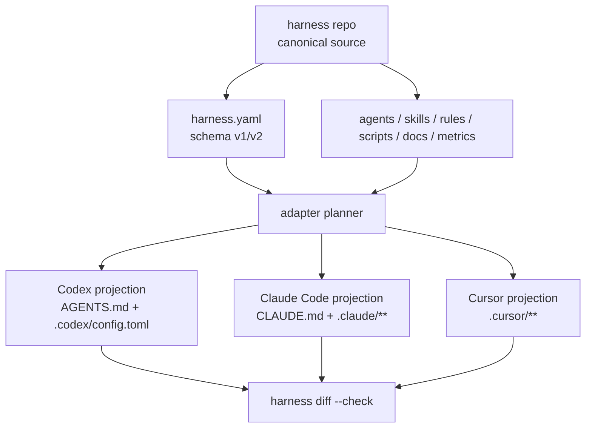
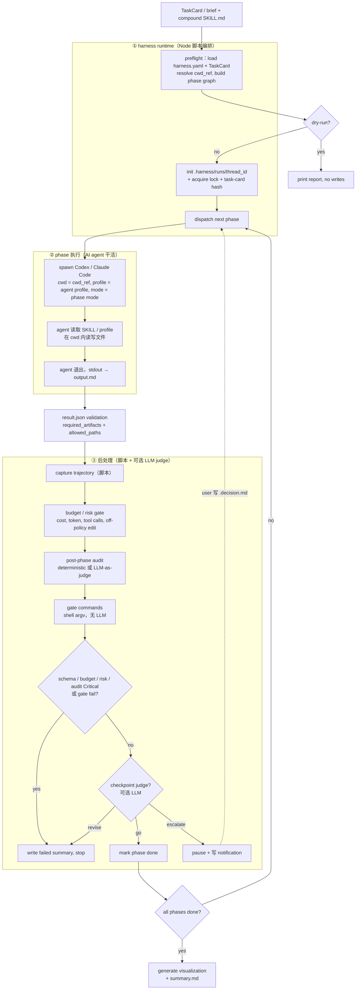

# harness-cli

harness-cli 把一份 canonical 配置写到 Codex、Claude Code、Cursor 各自的工作目录里去。仓库本身已经初始化完成：用 Codex 搭起了 monorepo、质量检查脚本，以及一个能直接跑起来的 TypeScript 工作区。

仓库根目录的 [harness.yaml](./harness.yaml) 是本项目自己的 Codex 开发环境声明；`harness doctor` 会读取它做环境检查。

## Quick Start

```bash
harness init my-harness
cd my-harness
harness sync
```

## 两条核心工作流

harness-cli 提供三条彼此独立、可单独使用的工作流：

| 工作流                   | 做什么                                                                             | 主要命令                                                                |
| ------------------------ | ---------------------------------------------------------------------------------- | ----------------------------------------------------------------------- |
| **Spec Sync**            | 把 harness repo 里的平台无关资产投影成 Codex / Claude Code / Cursor 工具目录       | `harness sync` / `harness diff --check`                                 |
| **Autonomous Execution** | 读取 compound skill 的 phase spec，按 agent / tool / cwd / gate / audit 多阶段执行 | `harness run --dry-run` → `harness run` → `harness run inspect/view`    |
| **KM Module Design Workflow**   | 为 km-module-design 生成三方并行 contributor 工作区，并支持逐步运行、校验和清理           | `harness km-module-design prepare` → `contributors` / `integrate` / `validate` |

下面几节分别展开。

---

## Spec Sync 工作流

### 概念图



### 关键规则

- `harness.yaml` 是配置入口，`harness.local.yaml` 只放本机路径覆盖，默认参与 `sync/diff`。
- `schema_version: 2` 支持 `agent_tools`，可以把不同 agent 路由到 `codex` 或 `claude-code`。
- `harness sync` 只写 adapter 生成态文件，不修改 canonical source。
- `harness diff --check` 用来确认生成态没有 drift。

### 工具开关与资产

打开 Cursor 投影：`tools` 改成 `[codex, cursor]`，跑 `harness sync`。

打开 Claude Code 投影：`tools` 改成 `[claude-code, codex]`，跑 `harness sync`，会生成 `CLAUDE.md`。

更细粒度的 Claude Code 资产按下表把 canonical source 放进 harness repo，再跑一次 `harness sync` 投影到 `.claude/`：

| 资产                  | canonical 路径                               | 投影目标                               |
| --------------------- | -------------------------------------------- | -------------------------------------- |
| 子 agents             | `claude/agents/<name>.md`                    | `.claude/agents/<name>.md`             |
| commands              | `claude/commands/<name>.md`                  | `.claude/commands/<name>.md`           |
| skills（含资源/脚本） | `claude/skills/<name>/SKILL.md` 及目录树     | `.claude/skills/<name>/`，保留可执行位 |
| hook 脚本             | `claude/scripts/<name>.sh` 或 `<subdir>/...` | `.claude/scripts/`，保留可执行位       |
| rules                 | `claude/rules/<name>.md`                     | `.claude/rules/<name>.md`              |

其余配置走 `harness.yaml` 顶层字段，最终落到 `.claude/settings.json`：

- **lifecycle hooks / Claude 专用 MCP**：`tools` 加 `claude-code`，再声明 `hooks.SessionStart` / `hooks.PostToolUse` / `hooks.Stop` 或 `mcp.servers`。已经有自己的 `.claude/settings.json` 时，第一次接管显式跑 `harness sync --adopt-settings`。
- **plugin marketplaces / enabled plugins**：声明 `plugins.marketplaces` 和 `plugins.enabled`。这一步只同步声明，不会替你跑 `claude plugin install`。Sailor 风格用户可以把 `plugins.format` 改成 `enabledPlugins`，渲染成 `{ "<plugin-id>": true }` 对象而不是 `plugins: []` 数组。
- **跨仓 registry**：声明 `reference_projects.projects`，单独落到 `.claude/reference-project.json`。

### 反向迁出（adopt）

如果你已经有一个现成的 Claude Code 工作区，可以反向迁出成 harness repo：

```bash
harness adopt ~/Workspace/my-project --output ~/Claude/my-project-harness --name my-project-harness
cd ~/Workspace/my-project
harness diff --harness-repo ~/Claude/my-project-harness
harness sync --harness-repo ~/Claude/my-project-harness --adopt-settings
```

也可以从已有 `.claude/` 目录直接起步：先跑 `harness adopt <source>` 把 `agents/skills/rules/scripts/docs/metrics/reference-project.json` 迁成独立 harness repo，再用 `harness sync --harness-repo <path>` 回写原仓做 zero-drift 对账。

### 一键 Codex-only 环境

业务实验前可以用自带脚本把目标 harness 仓同步成干净的 Codex-only 环境。脚本只启用 `codex` adapter，跳过 `harness.local.yaml`，执行 skill graph / inventory 检查（如果目标仓存在对应脚本），然后跑 `sync` 和 `diff --check`：

```bash
bash scripts/prepare-codex-env.sh --harness-repo ~/Workspace/sailor-harness
```

只刷新 `AGENTS.md` 与 `.codex/config.toml`，不渲染 `.claude/**`、`.cursor/**` 或 `.agents/**`。目标仓已存在 `.agents/` 时脚本默认失败，避免把旧 Codex 投影误当成 canonical 资产；确认需要保留时显式加 `--allow-agents-dir`。

### dispatch 表与模型注入

如果 harness repo 里声明了 `projects.targets.*`、`models.*` 和 `dispatch.patterns`，`harness sync` 会把 dispatch 表渲染进带 `HARNESS_DISPATCH_TABLE` marker 的规则文件，并按 agent 名把 `model:` 注入 `.claude/agents/*.md` frontmatter。本地路径写在同目录的 `harness.local.yaml`，需要跳过本地覆盖时跑 `harness sync --no-local` 或 `harness diff --no-local`。

### no-active-context

要保留历史实验产物但避免污染下一轮 agent context，声明 `no-active-context`：

```yaml
context:
  no_active_context:
    - path: docs/archive/
      reason: Historical experiment output; only inspect when the user asks.
      mode: deny_read
```

Codex adapter 会把它投影成 `.codex/config.toml` 的默认 permissions profile，archive 路径在 `:project_roots` 下标成 `"none"`；Claude Code adapter 会把它投影到 `.claude/settings.json` 的 `permissions.deny` 和 `sandbox.filesystem.denyRead`。

### git pre-commit hook

```yaml
hooks:
  pre-commit:
    run: |
      set -e
      harness diff --check
```

跑 `harness sync`。hook 写到 `.git/hooks/pre-commit`，假定 `harness` 可从 `PATH` 直接调用。

### MCP 声明

```yaml
mcp:
  servers:
    github:
      command: npx
      args: ["-y", "@modelcontextprotocol/server-github"]
      env:
        GITHUB_TOKEN: "${GITHUB_TOKEN}"
```

把 `tools` 配成包含 `codex`、`cursor` 或 `claude-code`，跑 `harness sync`。同一份声明会渲染到 `.codex/config.toml`、`.cursor/mcp.json` 和 / 或 `.claude/settings.json`。

### Claude Code plugins

```yaml
plugins:
  marketplaces:
    - id: everything-claude-code
      source: github:affaan-m/everything-claude-code
      autoUpdate: true
  enabled:
    - "skill-health@everything-claude-code"
    - id: "everything-claude-code"
      scope: local
```

跑 `harness sync`。`marketplaces` / `plugins` 会渲染进 `.claude/settings.json`，但不会替你执行安装。

### Adapter Queries

```bash
harness adapters list
harness adapters capabilities --json
harness adapters capabilities codex --format json
harness adapters capabilities claude-code
harness adapters capabilities cursor
```

---

## KM Module Design Workflow

`harness km-module-design` 用来把模块规格设计拆成可执行步骤。它会在目标 harness 仓里生成 `.harness/runs/km-module-design/<run>/`，并在 `spec-package/<business>/<module>/spec-pack/` 下放一个 draft manifest。

```bash
harness km-module-design prepare \
  --harness-repo ~/Workspace/sailor-harness \
  --business shop \
  --module productlist \
  --machpro-repo ../sailor_fe_c_transaction_dynamic \
  --machpro-path src/pages/shop/c_shop_global \
  --android-repo ../sailor_fe_c_transaction_android \
  --ios-repo ../sailor_fe_c_transaction_ios
```

每一步都可以单独执行：

```bash
harness km-module-design contributors --harness-repo ~/Workspace/sailor-harness --business shop --module productlist --run-id <id> --agent-command-template '<agent-cli> ... {prompt_file} ...'
harness km-module-design integrate --harness-repo ~/Workspace/sailor-harness --business shop --module productlist --run-id <id> --agent-command-template '<agent-cli> ... {prompt_file} ...'
harness km-module-design validate --harness-repo ~/Workspace/sailor-harness --business shop --module productlist
harness km-module-design status --harness-repo ~/Workspace/sailor-harness --business shop --module productlist --run-id <id>
harness km-module-design clean --harness-repo ~/Workspace/sailor-harness --business shop --module productlist --run-id <id>
```

想一次性跑 prepare + 三个 contributor + integrator：

```bash
harness km-module-design run \
  --harness-repo ~/Workspace/sailor-harness \
  --business shop \
  --module productlist \
  --agent-command-template '<agent-cli> ... {prompt_file} ...' \
  --run-integrator
```

---

## Autonomous Execution 工作流

### 概念模型

**谁在驱动？** harness runtime 是用 Node 写的编排脚本，本身不写代码、不做判断。每个 phase 真正干活的是 runtime spawn 出来的外部 AI 工具（Codex 或 Claude Code）——agent 在 `cwd_ref` 指定的目录里读取 SKILL / profile，按 prompt 读写文件。runtime 只负责 preflight、按顺序调度 phase、捕获产物，再跑 phase 之后的 deterministic gate（shell argv，不走 LLM）。可选的 audit judge 和 checkpoint judge 是另外两次独立的 LLM 调用，runtime 拉起来给 phase 产物打分或决定是否 escalate。

简化成一句话：**TaskCard 定边界 → runtime（脚本）编排顺序 → agent（LLM）执行单个 phase → schema / gate / audit / checkpoint 做完成校验 → eval 复盘**。

几个核心术语：

- **compound skill**：在 `SKILL.md` frontmatter 里声明多个 phase 的工作流。
- **TaskCard**：真实执行的任务契约，声明目标、验收、允许路径、禁止动作、测试命令、风险等级和预算。
- **phase**：一个执行单元，包含 `agent` / `tool` / `cwd_ref` / `mode` / `gate` / `audit`。
- **run**：一次完整执行，所有产物落到 `.harness/runs/<thread_id>/`。
- **cwd_ref**：phase 进入哪个目录工作，只允许 `harness` / `target:<name>` / `reference:<name>`。
- **gate command**：phase 后的 deterministic 校验，只接受结构化 `argv`，不走 shell expansion。
- **checkpoint judge**：可选的 LLM 审核节点，在 deterministic gate 之上加一道判断（默认关闭）。

### 流程总览



### 标准执行链

```
1. dry-run（预演，不写盘）
       ↓ 校验通过
2. real run（落盘执行）
       ↓ checkpoint 暂停时
3. resume（写 .decision.md 后恢复）
       ↓ 完成或失败后
4. inspect / view / eval（产物回放和 A/B 对比）
```

下面四节按这个顺序展开。

### 1. Dry-run（预演）

真实长程执行前先用 dry-run 检查 compound workflow 是否能被安全解析：

```bash
harness run --dry-run --compound compound-km-auto-feature --harness-repo ~/Workspace/sailor-harness --json
```

也可以直接指定 `SKILL.md`：

```bash
harness run --dry-run --skill skills/compound/compound-km-auto-feature/SKILL.md --harness-repo ~/Workspace/sailor-harness
```

dry-run 读：

- `harness.yaml`
- `skills/compound/<name>/SKILL.md` frontmatter 里的 `phases`
- `.gitignore`（确认 `.harness/` 和 run root 被忽略）

dry-run 输出：

- phase graph
- 每个 phase 的 `agent` / `tool` / `profile` / `mode`，以及 Codex inline profile 是否可解析
- 每个 phase 的 `cwd_ref` 和解析后的 cwd
- `parallel_group`
- pre-phase gate / gate command 数量
- provider stall watchdog 配置
- 默认 run root：`.harness/runs/<thread_id>/`
- 如果传入 `--task-card`，会校验 TaskCard schema 并展示 `task_card_hash`

dry-run 不创建 `.harness/runs`，也不修改目标仓。

### 2. Real run（真实执行）

真实执行推荐先提供 TaskCard，让 runtime 有稳定边界：

```json
{
  "goal": "实现商品列表模块到 TDD RED",
  "acceptance_criteria": [
    "architect.md 和 todo.md 存在",
    "双端 RED 测试可复现"
  ],
  "allowed_paths": [
    "docs/productlist/**",
    "targets/android/**",
    "targets/ios/**"
  ],
  "denied_actions": ["不要发布", "不要删除历史分支"],
  "test_commands": ["git diff --check"],
  "risk_level": "medium",
  "budget": {
    "max_tokens": 200000,
    "max_cost_usd": 5,
    "timeout_seconds": 900,
    "max_tool_calls": 200
  },
  "human_review_required": true,
  "context_paths": ["docs/architecture/dual-platform-contract.md"]
}
```

确认 dry-run 后启动真实执行：

```bash
harness run --compound compound-km-auto-feature --harness-repo ~/Workspace/sailor-harness --thread-id exp-001 --task-card docs/task-card.json
```

需要 LLM 审核节点和 checkpoint 时，显式打开 provider judge：

```bash
harness run --compound compound-km-auto-feature --harness-repo ~/Workspace/sailor-harness --thread-id exp-001 --task-card docs/task-card.json --judge-tool codex --judge-profile checkpoint-judge
```

也可以用内联 brief：

```bash
harness run --skill skills/compound/compound-km-auto-feature/SKILL.md --harness-repo ~/Workspace/sailor-harness --thread-id exp-001 --prompt "目标：只跑 architect 到 TDD RED"
```

真实执行会：

- 初始化 `.harness/runs/<thread_id>/`，写入 `brief.md`、`state.json`、`events.jsonl`、`phase_graph.json` 和 `lock`。
- 如果传入 TaskCard，写入 `task-card.json`、`task-card.sha256`，并把 hash 注入 phase prompt、`session.json`、`summary.md` 和 `run-family.json`。
- 按 `phases` 顺序执行；连续相同 `parallel_group` 的 phase 会并行执行。
- 每个 phase 先执行 `pre_phase_gate_commands`；环境类失败会标记为 `environment_blocked`，不会启动 agent。
- 每个 phase 通过 `cwd_ref` 进入 `harness`、`target:<name>` 或 `reference:<name>`。
- 每个 phase 可声明 `mode`。Claude Code 透传为 `claude -p --permission-mode <mode>`；Codex 默认仍是 `--full-auto`，`mode: plan` 会改成只读计划执行（`sandbox_mode=read-only`、`approval_policy=never`，不加 `--full-auto`）。
- 子进程 stdout 作为 phase `output.md`，同时保留 `stdout.log` / `stderr.log`。
- phase 结束后会校验或合成 `result.json`，结构字段为 `status`、`summary`、`changed_files`、`commands_run`、`tests`、`risk_flags`、`next_action`。
- `changed_files` 越过 TaskCard `allowed_paths`、`required_artifacts` 缺失、非法 `result.json` 会被标为 Critical。
- budget guard 会检查 token、cost、tool call 和超时预算；risk gate 会拦截依赖 / CI / 发布脚本变更、联网风险、测试红灯、多次 retry 等高风险信号。
- phase 运行前会记录 git diff baseline；失败、gate fail、audit blocked 或预算 / 风险阻塞时只生成 `rollback/<phase_id>/rollback.md` 建议，不自动执行 destructive reset。
- provider watchdog 会捕获 `ERROR: Reconnecting... 5/5` 和无输出超时，失败原因标记为 `provider_stalled`，不混成代码失败。
- phase prompt 会注入 `Harness-Phase-Fingerprint`，用于轨迹精确绑定。
- phase 结束后捕获 trajectory、跑 post-phase audit、再执行 gate commands；失败或中断 phase 额外写 `partial-output.md`。
- phase 失败、audit Critical 或 gate fail 会停止整轮并写 `summary.md`。
- 每个 phase / parallel group 通过 gate 后都会生成 checkpoint artifact；未启用 judge 时为 deterministic-only，启用 judge 时 `go` 继续，`revise` 停止并写反馈，`escalate` 写入 `notifications/*.request.md` 并暂停。
- 成功或失败都会生成 `visualization/run.html`。

CLI 默认不启用 provider-backed judge；未传 `--judge-tool` 时会写 deterministic-only checkpoint，只跑 deterministic audit/gate。真实实验推荐显式传 `--judge-tool codex`，这样 post-phase audit 和 checkpoint 都能做 contract-aware 评分。Codex judge 不使用 `--full-auto`，避免把只读审核变成默认写权限执行。

### 3. Pause / Resume

checkpoint judge `escalate` 后，run 暂停并把请求写到 `.harness/runs/<thread_id>/notifications/*.request.md`。在同目录写入对应的 `.decision.md`，再跑：

```bash
harness run --resume exp-001 --harness-repo ~/Workspace/sailor-harness
```

### 4. Inspect / View / Eval

执行完成后按节点回放产物：

```bash
harness run inspect <thread_id> --harness-repo ~/Workspace/sailor-harness
harness run view <thread_id> --harness-repo ~/Workspace/sailor-harness
harness eval ingest --run <thread_id> --harness-repo ~/Workspace/sailor-harness
harness eval run --scenario productlist-red --harness-repo ~/Workspace/sailor-harness
harness eval compare --base .harness/runs/base --head .harness/runs/head
```

- `inspect` 输出 run liveness、每个 phase 的状态、审核分、Critical 数、trajectory 捕获状态、工具调用数量、group audit 和 partial output 链接。
- `inspect` / `view` 会展示 TaskCard、result/budget/risk validation、rollback 链接和 run-family 摘要。
- `view` 按 `phase_graph.json` 生成 `visualization/run.html` 与 `visualization/workflow.mmd`，本地查看 workflow DAG、并行组和节点明细。
- `eval ingest --run` 把每个 phase 的 `common-events.jsonl` 合并成 EvalLog，复用现有 funnel scorer。
- `eval run --scenario <id>` 读取 `evals/scenarios/<id>.yaml`，用其中的 TaskCard 和 compound/skill 跑一轮真实 workflow。
- `eval compare --base <run-root> --head <run-root>` 输出 `task_success_rate`、`tests_green_rate`、`trace_completeness`、`off_policy_edit_rate`、延迟、token 和成本对比。
- trajectory 必须通过 `session_id + Harness-Phase-Fingerprint + cwd + phase 时间窗口` 校验；不满足则标记 `trajectory_missing`，不会绑定最近 session。
- phase audit 支持注入 `auditJudge` 作为 LLM-as-judge sidecar；没注入时使用离线 deterministic audit，`Critical`、必需产物缺失与 deterministic gate fail 仍会阻塞。

### Phase Spec 形式

Compound skills 在 `SKILL.md` frontmatter 里声明 phases：

```yaml
---
name: compound-example
phases:
  - phase_id: android-coder
    agent: android-coder
    tool: codex
    cwd_ref: target:android
    profile: android-coder
    mode: plan
    parallel_group: platform-coders
    provider_stall_timeout_seconds: 900
    allowed_write_roots:
      - "."
    pre_phase_gate_commands:
      - id: android_sdk
        kind: env
        cwd_ref: target:android
        argv: ["bash", "scripts/env-check.sh"]
        timeout_seconds: 60
    post_phase_audits:
      - audit_id: contract-aware
        context_paths:
          ["docs/productlist/architect.md", "docs/productlist/todo.md"]
        required_output_paths: ["docs/productlist/report.md"]
    gate_commands:
      - id: compile_android
        kind: compile
        cwd_ref: target:android
        argv: ["./gradlew", ":foundation:mvvm:compileDebugKotlin"]
        timeout_seconds: 600
---
```

`cwd_ref` 只允许这些形式：

- `harness`：harness repo 根目录。
- `target:<name>`：`harness.yaml.projects.targets.<name>.path`。
- `reference:<name>`：`harness.yaml.projects.references.<name>.path`，默认只读。

Gate command 必须是结构化 `argv`，不走 shell expansion。`rm`、`mv`、`curl`、`wget`、`ssh`、`scp` 以及 `git commit/push/reset/checkout` 在 gate context 中会被拒绝。

### Run 产物目录

```text
.harness/runs/<thread_id>/
  state.json
  events.jsonl
  phase_graph.json
  lock
  phases/<phase_id>/
    output.md
    partial-output.md
    prompt.md
    stdout.log
    stderr.log
    exit_code.json
    session.json
    trajectory.json
    cost.json
  trajectory/<phase_id>/
    common-events.jsonl
    events.jsonl
    summary.json
  audits/<phase_id>/
    default.json
    default.md
  visualization/
    workflow.mmd
    run.html
  gates/
  checkpoints/
  notifications/
  summary.md
```

`.harness/` 必须被 `.gitignore` 忽略；否则 runtime 会在写入前 fail fast。

### Runtime 现状

当前 TypeScript runtime 已有 autonomous execution 的核心模块：run store、safe command runner、phase executor、trajectory capture、post-phase audit、static visualization、deterministic gates、checkpoint judge、pause/resume、drift checkpoint，以及 mock compound E2E。CLI 已开放真实执行、dry-run、resume 与 run artifact inspect/view 入口。

### 已知缺口

2026-05-05 的 productlist 真实实验暴露了几项 runtime 缺口，已沉淀到 [docs/autonomous-execution-design.md](./docs/autonomous-execution-design.md) 的 `Productlist Real Run Retrospective`。当前已补齐：fingerprint 轨迹绑定、stale lock liveness、interrupted phase 产物修复、`phase_graph.json` 展示顺序、deterministic-only checkpoint、pre-phase env gate、provider stall watchdog 和必需产物 audit。

- 多次恢复会把一个逻辑 workflow 拆成多个 run，当前 `inspect/view` 还不能自动 stitch run family。
- provider raw log 仍不默认复制，只保存 normalized trajectory；需要更强审计时可后续加显式 raw-log opt-in。
- phase audit 仍以 deterministic + 可选 judge 为主；更复杂的跨 run family 一致性评分还需要单独设计。

---

## Setup

1. 准备 Node 20+，推荐 Node 22。

```bash
source "$HOME/.nvm/nvm.sh"
nvm install 22
nvm use 22
```

如果你不用 `nvm`，也可以用 Homebrew：

```bash
brew install node@22
```

2. 运行环境自检。

```bash
bash scripts/env-check.sh
```

`env-check.sh` 会优先使用当前 shell 的 `node`，版本过低时自动探测 `~/.nvm/versions/node` 里已安装的 Node 20+ 版本并给出结果。

项目内的 `npm run lint` / `npm test` / `npm run build` 等质量门脚本也会通过 `scripts/run-node-tool.sh` 自动切到可用的 Node 20+ runtime，所以即使当前 shell 默认仍是旧版 Node，ESLint / Vitest 也不会跑在不受支持的 runtime 上。

3. 安装依赖并验证基础流程。

```bash
npm install
npm run build
npm test
npx harness doctor
```

4. 日常开发前后跑这些脚本。

```bash
bash scripts/pre-commit.sh
bash scripts/ci.sh
```

## Workspace Layout

- `packages/core`: 纯逻辑、无 IO 入口的核心库。
- `packages/cli`: `harness` CLI，依赖 `@harness/core`。
- `scripts/`: 环境检查、架构校验、CI 与 pre-commit 入口。
- `AGENTS.md.template`: Codex / Claude / Cursor 指令的 canonical source。
- `.codex/config.toml.template`: Codex config 的 canonical source。

`AGENTS.md`、`CLAUDE.md`、`.codex/config.toml`、`.claude/`、`.cursor/`、`.agents/` 是 adapter 投影生成态，已在 `.gitignore` 中忽略。不要直接提交这些文件。

## Quality Gates

- TypeScript strict mode + ESM
- ESLint + typescript-eslint
- Prettier
- Vitest
- Coverage threshold: 80%
- Architecture boundary checks via `bash scripts/lint-arch.sh`

## Useful Commands

```bash
npm run lint
npm run typecheck
npm run test:coverage
npm run build
npx harness help
npx harness doctor --json
npx harness adapters list --json
npx harness run --dry-run --compound compound-km-auto-feature --harness-repo ~/Workspace/sailor-harness --json
npx harness run --compound compound-km-auto-feature --harness-repo ~/Workspace/sailor-harness --thread-id exp-001 --prompt "目标：验证最新 workflow"
npx harness run inspect <thread-id> --harness-repo ~/Workspace/sailor-harness
npx harness run view <thread-id> --harness-repo ~/Workspace/sailor-harness
npx harness eval ingest --run <thread-id> --harness-repo ~/Workspace/sailor-harness
```
